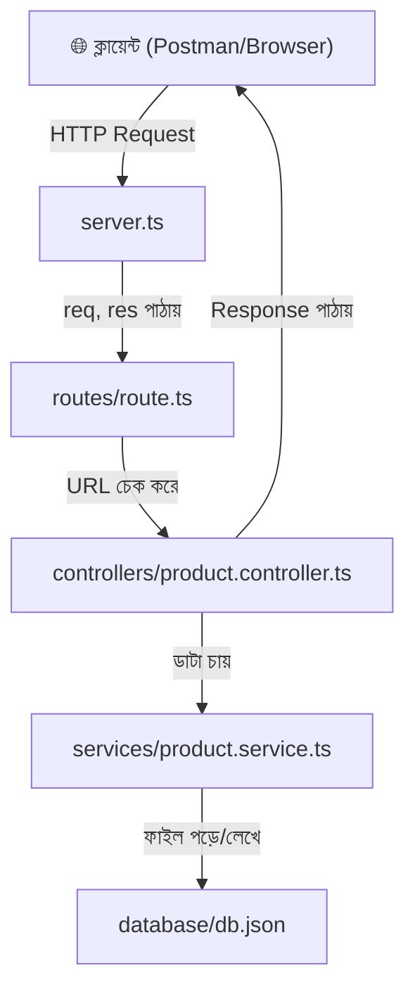
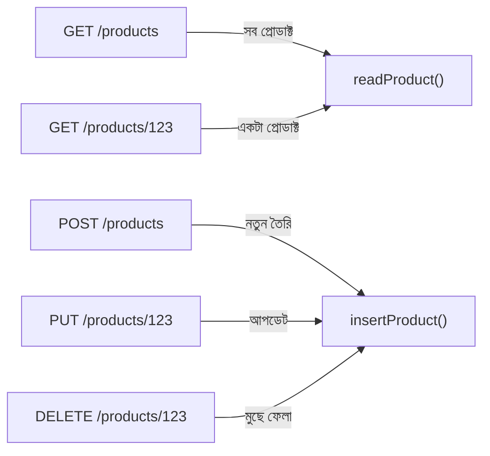
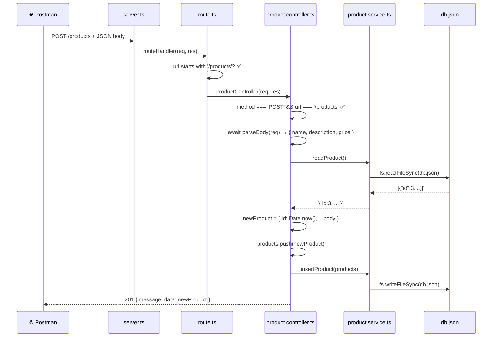

# 📘 মডিউল ৫ — সম্পূর্ণ ব্যাখ্যামূলক গাইড (Core Concepts থেকে Deep Dive)

> **✍️ Author:** Abdul Mazid
> **🌐 Portfolio:** [abdulmazid-portfolio.vercel.app](https://abdulmazid-portfolio.vercel.app/)
> **🤖 Note:** _এই সম্পূর্ণ গাইডটি আমি নিজে প্র্যাকটিস করার সময় AI-এর সাহায্য নিয়ে বিস্তারিত ও সুন্দরভাবে গুছিয়ে তৈরি করেছি, যেন আমার মতো অন্যান্যদেরও কনসেপ্টগুলো বুঝতে সুবিধা হয়।_

> [!NOTE]
> এই ক্লাসে তুমি শিখেছো কিভাবে **কোনো ফ্রেমওয়ার্ক (Express/Fastify) ছাড়াই** শুধুমাত্র Node.js এর বিল্ট-ইন `http` মডিউল দিয়ে একটি সম্পূর্ণ **REST API** তৈরি করা যায়। এটা বোঝা অত্যন্ত গুরুত্বপূর্ণ কারণ Express/Fastify এর ভিতরেও এই `http` মডিউলই কাজ করে।

---

## 🧱 ০. প্রজেক্টের সার্বিক ছবি (Big Picture)

তোমার প্রজেক্টের ফোল্ডার স্ট্রাকচার:

```
module-5/
├── package.json          ← প্রজেক্টের "পরিচয়পত্র"
├── tsconfig.json         ← TypeScript এর নিয়ম-কানুন
├── src/
│   ├── server.ts         ← ⭐ এন্ট্রি পয়েন্ট (এখান থেকে সব শুরু)
│   ├── config/
│   │   └── index.ts      ← Environment Variable ম্যানেজমেন্ট
│   ├── routes/
│   │   └── route.ts      ← URL অনুযায়ী ট্রাফিক পরিচালনা
│   ├── controllers/
│   │   └── product.controller.ts  ← ব্যবসায়িক লজিক (CRUD)
│   ├── services/
│   │   └── product.service.ts     ← ডাটাবেস পড়া/লেখা
│   ├── types/
│   │   └── product.type.ts        ← TypeScript টাইপ সংজ্ঞা
│   ├── utility/
│   │   ├── parseBody.ts   ← Request body পার্স করা
│   │   └── sendResponse.ts ← Response পাঠানো সহজ করা
│   └── database/
│       └── db.json        ← "ডাটাবেস" (আসলে একটা JSON ফাইল)
```

### এই আর্কিটেকচারের নাম: **Modular / Layered Architecture**



**কেন এভাবে ভাগ করা?**

| Layer          | দায়িত্ব                         | রিয়েল-ওয়ার্ল্ড উদাহরণ |
| -------------- | -------------------------------- | ----------------------- |
| **Server**     | সার্ভার চালু করা, পোর্ট শোনা     | হোটেলের গেট             |
| **Route**      | URL দেখে সঠিক জায়গায় পাঠানো    | হোটেলের রিসেপশনিস্ট     |
| **Controller** | রিকোয়েস্ট বুঝে সিদ্ধান্ত নেওয়া | হোটেলের ম্যানেজার       |
| **Service**    | আসল কাজ করা (ডাটা পড়া/লেখা)     | হোটেলের শেফ/রুম সার্ভিস |
| **Database**   | ডাটা সংরক্ষণ                     | হোটেলের স্টোর রুম       |

---

## 📦 ১. package.json — প্রজেক্টের "পরিচয়পত্র"

```json
{
  "name": "module-5",
  "version": "1.0.0",
  "scripts": {
    "dev": "tsx watch ./src/server.ts"
  },
  "devDependencies": {
    "@types/node": "^25.6.2",
    "typescript": "^6.0.3"
  },
  "dependencies": {
    "dotenv": "^17.4.2",
    "tsx": "^4.21.0"
  }
}
```

### 🔰 Core Concept: package.json কী?

প্রতিটি Node.js প্রজেক্টের একটি **পরিচয়পত্র** থাকে — সেটাই `package.json`। এখানে লেখা থাকে:

- প্রজেক্টের নাম, ভার্সন
- কী কী প্যাকেজ (লাইব্রেরি) দরকার
- কী কমান্ডে চালাতে হবে

### 🧩 Code Breakdown: dependencies vs devDependencies

| ক্যাটাগরি         | মানে                    | কখন লাগে       |
| ----------------- | ----------------------- | -------------- |
| `dependencies`    | প্রোডাকশনেও লাগবে       | সবসময়         |
| `devDependencies` | শুধু ডেভেলপমেন্টে লাগবে | কোড লেখার সময় |

- **`dotenv` (v17.4.2):** `.env` ফাইল থেকে গোপন তথ্য (PORT, DB_URL) পড়ে `process.env`-তে বসায়
- **`tsx` (v4.21.0):** TypeScript ফাইল সরাসরি রান করে (কম্পাইল না করেই!)
- **`typescript` (v6.0.3):** TypeScript কম্পাইলার — ২০২৬ সালের মার্চে রিলিজ হওয়া **শেষ JavaScript-ভিত্তিক ভার্সন** (পরের ভার্সন 7.0 Go ভাষায় লেখা হচ্ছে, 10x দ্রুত!)
- **`@types/node` (v25.6.2):** Node.js এর সব ফাংশনের TypeScript টাইপ ডেফিনিশন

### 🎯 scripts কী?

```json
"dev": "tsx watch ./src/server.ts"
```

`npm run dev` লিখলে এটা চলে। **tsx watch** মানে:

1. `server.ts` ফাইল চালাও
2. কোনো ফাইল বদলালে **অটোমেটিক রিস্টার্ট** করো

> [!TIP]
> **tsx** হলো **esbuild**-ভিত্তিক TypeScript রানার। এটা `ts-node` এর চেয়ে অনেক দ্রুত কারণ এটা Type Checking করে না — শুধু টাইপ মুছে দিয়ে JavaScript-এ কনভার্ট করে চালায়। Type Checking আলাদাভাবে `tsc --noEmit` দিয়ে করা উচিত।

### 🔬 অ্যাডভান্সড: `^` (caret) মানে কী?

`"dotenv": "^17.4.2"` — এই `^` মানে **minor ও patch আপডেট** নিতে রাজি:

- ✅ `17.4.3`, `17.5.0` — ইন্সটল হবে
- ❌ `18.0.0` — হবে না (major change)

এটা **Semantic Versioning (SemVer)** এর নিয়ম: `MAJOR.MINOR.PATCH`

---

## ⚙️ ২. tsconfig.json — TypeScript এর নিয়ম-কানুন

```json
{
  "compilerOptions": {
    "rootDir": "./src",
    "outDir": "./dist",
    "module": "esnext",
    "target": "esnext",
    "types": ["node"],
    "sourceMap": true,
    "declaration": true,
    "declarationMap": true,
    "strict": true,
    "verbatimModuleSyntax": true,
    "isolatedModules": true,
    "noUncheckedSideEffectImports": true,
    "moduleDetection": "force",
    "skipLibCheck": true,
    "noUncheckedIndexedAccess": true,
    "exactOptionalPropertyTypes": true
  }
}
```

### 🔰 Core Concept: tsconfig.json কেন?

TypeScript তো Browser/Node সরাসরি বোঝে না! এই ফাইল বলে দেয়:

- কোড কোথায় আছে (`rootDir`)
- কম্পাইল করে কোথায় রাখবে (`outDir`)
- কতটা কড়া নিয়ম মানবে (`strict`)

### 🧩 প্রতিটি অপশন বিস্তারিত:

| অপশন                   | মানে                           | কেন দরকার                          |
| ---------------------- | ------------------------------ | ---------------------------------- |
| `rootDir: "./src"`     | সোর্স কোড `src/`-তে            | ফোল্ডার স্ট্রাকচার পরিষ্কার        |
| `outDir: "./dist"`     | কম্পাইল করা JS `dist/`-তে যাবে | সোর্স ও আউটপুট আলাদা               |
| `module: "esnext"`     | ESM (import/export) ব্যবহার    | মডার্ন JavaScript মডিউল সিস্টেম    |
| `target: "esnext"`     | লেটেস্ট JS ফিচার ব্যবহার       | Node.js নতুন ভার্সন সব সাপোর্ট করে |
| `strict: true`         | সব strict check চালু           | বাগ প্রতিরোধ                       |
| `verbatimModuleSyntax` | `import type` বাধ্যতামূলক      | TS 6.0 এর রেকমেন্ডেশন              |

### 🔬 Under the Hood (Deep Dive): `verbatimModuleSyntax` কী?

এটা TypeScript 5.0+ এর একটা গুরুত্বপূর্ণ ফিচার। এটা বলে: **"তুমি যদি শুধু টাইপ import করো, তাহলে `import type` লিখতে হবে":**

```typescript
// ❌ এটা এখন এরর দিবে:
import { IProduct } from './types';

// ✅ এটা সঠিক (যদি IProduct শুধু টাইপ হয়):
import type { IProduct } from './types';
```

**কেন?** কারণ রানটাইমে টাইপের কোনো অস্তিত্ব নেই। `import type` ব্যবহার করলে বান্ডলারকে (esbuild/tsx) স্পষ্ট জানিয়ে দেওয়া হয় যে "এই import-টা রানটাইমে দরকার নেই, মুছে দাও।"

---

## 🌿 ৩. dotenv ও config — Environment Variable

### [config/index.ts](file:///d:/next-level-course/Mission-2/module-6/src/config/index.ts)

```typescript
import dotenv from 'dotenv';
import path from 'path';

dotenv.config({ path: path.resolve(process.cwd(), '.env') });

const config = {
  port: Number(process.env.PORT),
};

export default config;
```

### 🔰 Core Concept: Environment Variable কী?

ধরো তুমি একটা অ্যাপ বানালে। তোমার কম্পিউটারে PORT `3000`, তোমার বন্ধুর কম্পিউটারে PORT `5000`, সার্ভারে PORT `8080`। এই ভ্যালুগুলো কোডে হার্ডকোড না করে **.env ফাইলে** রাখা হয়:

```env
PORT=3000
```

### 🧩 লাইন বাই লাইন:

**`import dotenv from 'dotenv'`** — dotenv প্যাকেজ আনো

**`import path from 'path'`** — Node.js এর বিল্ট-ইন path মডিউল (ফাইল পাথ হ্যান্ডলিং)

**`dotenv.config({ path: path.resolve(process.cwd(), '.env') })`** — এটা ৩টা জিনিস করে:

1. `process.cwd()` → তুমি যেখান থেকে `npm run dev` চালাচ্ছো সেই ফোল্ডারের পাথ (যেমন: `d:\next-level-course\Mission-2\module-6`)
2. `path.resolve(...)` → সেই পাথের সাথে `.env` জোড়া লাগায় → `d:\next-level-course\Mission-2\module-6\.env`
3. `dotenv.config(...)` → সেই ফাইল পড়ে `process.env`-তে বসায়

**`Number(process.env.PORT)`** — `.env` থেকে সবকিছু **string** হিসেবে আসে। `Number()` দিয়ে সংখ্যায় রূপান্তর করা হচ্ছে।

### 🚀 Advanced (Best Practice): কেন config আলাদা ফাইলে?

1. **Single Source of Truth:** পুরো অ্যাপে `process.env.PORT` বারবার না লিখে `config.port` লেখা
2. **Validation:** চাইলে এখানে চেক করা যায় PORT আছে কিনা
3. **Type Safety:** TypeScript-এ `process.env.PORT` হলো `string | undefined`, কিন্তু `config.port` হলো `number`

---

## 🚀 ৪. server.ts — সার্ভার চালু

### [server.ts](file:///d:/next-level-course/Mission-2/module-6/src/server.ts)

```typescript
import { createServer, IncomingMessage, Server, ServerResponse } from 'http';
import config from './config';
import { routeHandler } from './routes/route';

const server: Server = createServer((req: IncomingMessage, res: ServerResponse) => {
  routeHandler(req, res);
});

server.listen(config.port, () => {
  console.log(`The server is running on the port ${config.port}`);
});
```

### 🔰 Core Concept: HTTP সার্ভার কী?

**রিয়েল ওয়ার্ল্ড উদাহরণ:** ধরো তুমি একটা রেস্তোরাঁ খুলেছো।

- **সার্ভার** = রেস্তোরাঁ
- **পোর্ট** = রেস্তোরাঁর দরজা নম্বর (পোর্ট 3000 = দরজা নং ৩০০০)
- **Request** = কাস্টমার এসে অর্ডার দেওয়া
- **Response** = ওয়েটার খাবার দেওয়া

### 🧩 Code Breakdown: প্রতিটি শব্দ ধরে ধরে

**`import { createServer, IncomingMessage, Server, ServerResponse } from 'http'`**

Node.js এর বিল্ট-ইন `http` মডিউল থেকে ৪টা জিনিস আনা হচ্ছে:

| নাম               | টাইপ       | কী করে                         |
| ----------------- | ---------- | ------------------------------ |
| `createServer`    | ফাংশন      | সার্ভার তৈরি করে               |
| `IncomingMessage` | ক্লাস/টাইপ | Request অবজেক্ট (req) এর টাইপ  |
| `ServerResponse`  | ক্লাস/টাইপ | Response অবজেক্ট (res) এর টাইপ |
| `Server`          | ক্লাস/টাইপ | সার্ভার অবজেক্ট এর টাইপ        |

**`createServer((req, res) => { ... })`** — এটা একটা সার্ভার তৈরি করে। ভিতরের ফাংশনটাকে বলে **request listener/callback**। প্রতিবার কেউ সার্ভারে রিকোয়েস্ট পাঠালে এই ফাংশন চলে।

- **`req` (IncomingMessage):** কাস্টমার কী চায় — কোন URL, কোন method (GET/POST), কী ডাটা পাঠিয়েছে
- **`res` (ServerResponse):** কাস্টমারকে উত্তর দেওয়ার মাধ্যম

**`server.listen(config.port, callback)`** — সার্ভারকে বলছে: "পোর্ট 3000-এ কান পেতে রাখো। কেউ এলে callback চালাও।"

### 🔬 Under the Hood (Deep Dive): Event-Driven Architecture

Node.js **single-threaded event loop** ব্যবহার করে। মানে:

```
একটাই থ্রেড (কর্মী) → কিন্তু হাজার হাজার request হ্যান্ডেল করতে পারে!
```

**কিভাবে?** এটা প্রতিটি request-এর জন্য নতুন থ্রেড তৈরি করে না। বরং:

1. Request আসলো → Event Queue-তে গেলো
2. Event Loop সেটা তুলে নিলো → Callback চালালো
3. যদি I/O (ফাইল পড়া, DB query) দরকার হয় → অপারেটিং সিস্টেমকে দিয়ে দিলো → পরের request হ্যান্ডেল করতে গেলো
4. I/O শেষ হলে → আবার Event Queue-তে আসলো → Event Loop response পাঠালো

**`req` হলো একটা Readable Stream, আর `res` হলো Writable Stream:**

- **Readable Stream (req):** ডাটা টুকরো টুকরো (chunk) আকারে আসে — পুরোটা একবারে মেমরিতে লোড হয় না
- **Writable Stream (res):** ডাটা টুকরো টুকরো করে পাঠানো যায় — বড় ফাইল পাঠাতে এটা অত্যন্ত দরকারি

> [!IMPORTANT]
> Express.js, Fastify, Hapi — সব ফ্রেমওয়ার্কের ভিতরে এই `http.createServer()` ই কাজ করে। তুমি এখন সেই **মূল ভিত্তি** শিখছো যেটার উপরে সব ফ্রেমওয়ার্ক দাঁড়িয়ে আছে।

---

## 🗺️ ৫. route.ts — URL ট্রাফিক পরিচালনা (Routing)

### [route.ts](file:///d:/next-level-course/Mission-2/module-6/src/routes/route.ts)

```typescript
import type { IncomingMessage, ServerResponse } from 'http';
import { productController } from '../controllers/product.controller';

export const routeHandler = (req: IncomingMessage, res: ServerResponse) => {
  const url = req.url;
  const method = req.method;

  if (url === '/' && method === 'GET') {
    res.writeHead(200, { 'content-type': 'application/json' });
    res.end(JSON.stringify({ message: 'This is root route' }));
  } else if (url?.startsWith('/products')) {
    productController(req, res);
  } else {
    res.writeHead(404, { 'content-type': 'application/json' });
    res.end(JSON.stringify({ message: 'Route not found!' }));
  }
};
```

### 🔰 Core Concept: Routing কী?

**রিয়েল ওয়ার্ল্ড উদাহরণ:** ধরো তুমি একটা বিশাল শপিং মলে গেছো:

- `/` (মূল দরজা) → "স্বাগতম" বোর্ড
- `/products` → প্রোডাক্ট সেকশন
- `/users` → কাস্টমার সেকশন
- অন্য কিছু → "এই সেকশন নেই!"

Router হলো সেই **সিকিউরিটি গার্ড** যে দেখে তুমি কোথায় যেতে চাও এবং সঠিক জায়গায় পাঠায়।

### 🧩 লাইন বাই লাইন বিশ্লেষণ:

**`import type { IncomingMessage, ServerResponse } from 'http'`**

লক্ষ্য করো `import type` ব্যবহার হয়েছে, শুধু `import` না। কারণ:

- `IncomingMessage` ও `ServerResponse` এখানে **শুধু TypeScript টাইপ** হিসেবে ব্যবহার হচ্ছে (function parameter type)
- রানটাইমে এদের দরকার নেই
- `tsconfig.json`-এ `"verbatimModuleSyntax": true` থাকায় এটা **বাধ্যতামূলক**

**`req.url`** → ক্লায়েন্ট কোন URL-এ গেছে: `'/'`, `'/products'`, `'/products/123'`

**`req.method`** → কোন HTTP Method: `'GET'`, `'POST'`, `'PUT'`, `'DELETE'`

### HTTP Methods বোঝা (CRUD):

| Method   | কাজ              | বাংলা          | SQL সমতুল্য        |
| -------- | ---------------- | -------------- | ------------------ |
| `GET`    | ডাটা পড়া        | "দেখাও"        | `SELECT`           |
| `POST`   | নতুন ডাটা তৈরি   | "তৈরি করো"     | `INSERT`           |
| `PUT`    | পুরো ডাটা বদলানো | "বদলে দাও"     | `UPDATE` (full)    |
| `PATCH`  | আংশিক বদলানো     | "একটু ঠিক করো" | `UPDATE` (partial) |
| `DELETE` | মুছে ফেলা        | "মুছো"         | `DELETE`           |

### কোড ফ্লো:

```
Request আসলো → url ও method বের করো
                    ↓
        url === '/' && GET?
        ├── হ্যাঁ → "This is root route" পাঠাও
        └── না ↓
        url '/products' দিয়ে শুরু?
        ├── হ্যাঁ → productController-কে দিয়ে দাও
        └── না → "Route not found!" (404)
```

### 🎯 গুরুত্বপূর্ণ ডিটেইলস:

**`url?.startsWith('/products')`** — এখানে `?.` হলো **Optional Chaining**:

- `url` যদি `undefined` বা `null` হয়, তাহলে Error না দিয়ে সরাসরি `undefined` রিটার্ন করবে
- মানে: "url আছে? থাকলে startsWith চেক করো, না থাকলে থাক"

**`startsWith('/products')`** — এটা চেক করে URL `/products` দিয়ে শুরু হচ্ছে কিনা:

- ✅ `/products` → true
- ✅ `/products/123` → true
- ❌ `/users` → false

**`res.writeHead(200, { 'content-type': 'application/json' })`** — Response-এর হেডার সেট করা:

- `200` = HTTP Status Code (সব ঠিক আছে)
- `{ 'content-type': 'application/json' }` = বলছে "আমি JSON ডাটা পাঠাচ্ছি"

**`res.end(JSON.stringify({...}))`** — Response শেষ করা:

- `JSON.stringify()` → JavaScript object-কে JSON string-এ রূপান্তর
- `res.end()` → ক্লায়েন্টকে ডাটা পাঠিয়ে connection বন্ধ করো

### HTTP Status Codes:

| Code  | মানে                  | কখন ব্যবহার                   |
| ----- | --------------------- | ----------------------------- |
| `200` | OK                    | সব ঠিক আছে                    |
| `201` | Created               | নতুন কিছু তৈরি হয়েছে         |
| `204` | No Content            | সফল, কিন্তু কিছু পাঠানোর নেই  |
| `400` | Bad Request           | ক্লায়েন্ট ভুল ডাটা পাঠিয়েছে |
| `404` | Not Found             | URL খুঁজে পাওয়া যায়নি       |
| `500` | Internal Server Error | সার্ভারে সমস্যা               |

---

## 📐 ৬. product.type.ts — TypeScript Interface

### [product.type.ts](file:///d:/next-level-course/Mission-2/module-6/src/types/product.type.ts)

```typescript
export interface IProduct {
  id: number;
  name: string;
  description: string;
  price: number;
}
```

### 🔰 Core Concept: Interface কী?

**রিয়েল ওয়ার্ল্ড:** ধরো তুমি একটা ফর্ম ডিজাইন করছো:

- নাম: ****\_**** (টেক্সট হতে হবে)
- বয়স: ****\_**** (নম্বর হতে হবে)

Interface হলো সেই ফর্মের **ছাঁচ/টেমপ্লেট**। এটা বলে: "একটা Product-এ এই ফিল্ডগুলো এভাবে থাকতে হবে।"

```typescript
// ✅ সঠিক — সব ফিল্ড আছে, সব সঠিক টাইপ
const product: IProduct = {
  id: 1,
  name: 'Phone',
  description: 'A nice phone',
  price: 50000,
};

// ❌ এরর — price string হতে পারবে না
const bad: IProduct = {
  id: 1,
  name: 'Phone',
  description: 'A nice phone',
  price: '50000', // Type 'string' is not assignable to type 'number'
};
```

### 🧩 Code Breakdown: কেন `I` prefix?

`IProduct` — এই `I` হলো একটা **naming convention** (Programming Hero-র কোর্সে এটা শেখানো হচ্ছে):

- `I` = Interface বোঝায়
- কিছু কোম্পানি `I` ব্যবহার করে, কিছু করে না
- Microsoft/Angular সাধারণত `I` ব্যবহার করে
- Google/React সাধারণত করে না — শুধু `Product` লেখে

### 🚀 Advanced (Best Practice): Interface vs Type

TypeScript-এ দুইভাবে টাইপ ডিফাইন করা যায়:

```typescript
// Interface — শুধু object shape ডিফাইন
interface IProduct {
  id: number;
  name: string;
}

// Type Alias — যেকোনো টাইপ ডিফাইন
type Product = {
  id: number;
  name: string;
};

// Type Alias union করতে পারে
type Status = 'active' | 'inactive';

// Interface extends করতে পারে
interface IElectronics extends IProduct {
  warranty: number;
}
```

**সাধারণ নিয়ম:** Object shape → Interface, বাকি সব → Type

---

## 🔧 ৭. Utility Functions

### ৭.১ parseBody.ts — Request Body পার্সিং

### [parseBody.ts](file:///d:/next-level-course/Mission-2/module-6/src/utility/parseBody.ts)

```typescript
import type { IncomingMessage } from 'http';

export const parseBody = (req: IncomingMessage): Promise<any> => {
  return new Promise((resolve, reject) => {
    let body = '';
    req.on('data', (chunk) => {
      body += chunk;
    });
    req.on('end', () => {
      try {
        resolve(JSON.parse(body));
      } catch (error) {
        reject(error);
      }
    });
  });
};
```

### 🔰 Core Concept: কেন এই ফাংশন দরকার?

Express-এ তুমি সরাসরি `req.body` পেয়ে যাও। কিন্তু **Raw Node.js HTTP-তে** request-এর body সরাসরি পাওয়া যায় না! কারণ:

> ডাটা **একবারে** আসে না। **টুকরো টুকরো (chunk)** করে আসে।

**রিয়েল ওয়ার্ল্ড:** ধরো তুমি পোস্ট অফিস থেকে একটা বড় পার্সেল পাচ্ছো। কুরিয়ার ভাই পুরো জিনিসটা একবারে আনতে পারছে মোহ — ৩ ট্রিপে আনছে:

- ট্রিপ ১: বাক্সের উপরের অংশ
- ট্রিপ ২: মাঝের অংশ
- ট্রিপ ৩: নিচের অংশ → "শেষ!"

HTTP request-ও ঠিক এভাবে কাজ করে — এটাই **Stream**!

### 🧩 লাইন বাই লাইন:

**`return new Promise((resolve, reject) => { ... })`**

কেন Promise? কারণ ডাটা আসতে **সময় লাগে** — এটা asynchronous কাজ।

- `resolve(value)` → "কাজ সফল, এই নাও রেজাল্ট"
- `reject(error)` → "কাজ ব্যর্থ, এই নাও এরর"

**`let body = ''`** — একটা ফাঁকা string, এখানে সব chunk জমা হবে

**`req.on('data', (chunk) => { body += chunk; })`**

- `req` হলো Readable Stream
- `.on('data', callback)` → প্রতিটা chunk আসলে এই callback চলবে
- `body += chunk` → chunk-টাকে body string-এর সাথে জুড়ে দাও

```
chunk 1: '{"name":'        → body = '{"name":'
chunk 2: '"Phone","price":' → body = '{"name":"Phone","price":'
chunk 3: '50000}'           → body = '{"name":"Phone","price":50000}'
```

**`req.on('end', () => { ... })`** — সব chunk এসে গেলে `'end'` event fire হয়

**`resolve(JSON.parse(body))`** — পুরো JSON string-কে JavaScript object-এ রূপান্তর:

```
'{"name":"Phone","price":50000}'  →  { name: "Phone", price: 50000 }
```

**`catch (error) { reject(error) }`** — যদি invalid JSON আসে (যেমন `"{broken"`) তাহলে error ধরা

### 🔬 Under the Hood (Deep Dive): Event Emitter Pattern

`req.on()` — এটা Node.js এর **EventEmitter** প্যাটার্ন:

```typescript
// EventEmitter এর সরলীকৃত রূপ:
class EventEmitter {
  listeners = {};

  on(event, callback) {
    this.listeners[event] = this.listeners[event] || [];
    this.listeners[event].push(callback);
  }

  emit(event, data) {
    this.listeners[event]?.forEach((cb) => cb(data));
  }
}
```

`IncomingMessage` হলো `EventEmitter` এর child class। তাই `.on()` ব্যবহার করা যায়। Node.js HTTP parser যখন নেটওয়ার্ক থেকে ডাটা পায়, সে অভ্যন্তরীণভাবে `emit('data', chunk)` ও `emit('end')` কল করে।

### ⚠️ Backpressure কী?

যদি ডাটা অনেক দ্রুত আসে কিন্তু তুমি ধীরে process করো, তাহলে **backpressure** হয় — মেমরি ভরে যায়। Production-এ বড় file upload-এর জন্য `pipe()` বা streaming parser ব্যবহার করা উচিত। তবে ছোট JSON body-র জন্য এই approach ঠিক আছে।

---

### ৭.২ sendResponse.ts — রেসপন্স পাঠানো

### [sendResponse.ts](file:///d:/next-level-course/Mission-2/module-6/src/utility/sendResponse.ts)

```typescript
import type { ServerResponse } from 'http';

export const sendResponse = (
  res: ServerResponse,
  statusCode: number,
  success: boolean,
  message: string,
  data?: any
) => {
  const response = {
    success,
    message,
    data,
  };

  res.writeHead(statusCode, { 'content-type': 'application/json' });
  res.end(JSON.stringify(response));
};
```

### 🔰 Core Concept: কেন এই ফাংশন?

প্রতিবার response পাঠাতে তিনটা কাজ করতে হয়:

1. Status code সেট করো
2. Header সেট করো
3. JSON body পাঠাও ও connection বন্ধ করো

এই তিনটা কাজ **বারবার** করতে হয়। তাই একটা utility function বানানো হয়েছে — **DRY (Don't Repeat Yourself)** প্রিন্সিপল!

### 🧩 প্যারামিটার বিশ্লেষণ:

| প্যারামিটার  | টাইপ             | মানে             | উদাহরণ              |
| ------------ | ---------------- | ---------------- | ------------------- |
| `res`        | `ServerResponse` | Response অবজেক্ট | —                   |
| `statusCode` | `number`         | HTTP Status      | `200`, `404`, `500` |
| `success`    | `boolean`        | সফল হয়েছে কিনা  | `true` / `false`    |
| `message`    | `string`         | মেসেজ            | `"Product created"` |
| `data?`      | `any`            | ঐচ্ছিক ডাটা      | product object      |

**`data?: any`** — `?` মানে এটা **optional**। না দিলেও চলবে। কিন্তু `data?:` আর `data: ... | undefined` এক নয়:

```typescript
// tsconfig-এ "exactOptionalPropertyTypes": true থাকায়:
sendResponse(res, 200, true, 'OK'); // ✅ data দেওয়া হয়নি
sendResponse(res, 200, true, 'OK', products); // ✅ data দেওয়া হয়েছে
```

### 🎯 Shorthand Property:

```typescript
const response = { success, message, data };
// এটা আসলে:
const response = { success: success, message: message, data: data };
```

ES6 এর **shorthand property** — variable নাম আর property নাম একই হলে একবার লিখলেই হয়।

### 🎓 API Response Standard:

তোমার response structure:

```json
{
  "success": true,
  "message": "Products retrieved successfully",
  "data": [...]
}
```

এটা একটা ভালো প্র্যাক্টিস। Industry-তে এটাকে বলে **Envelope Pattern** বা **Standard API Response**। সব response একই shape-এ আসে বলে ফ্রন্টএন্ড ডেভেলপারের কাজ সহজ হয়।

> [!TIP]
> আরও ভালো করতে চাইলে `statusCode`-ও response body-তে রাখতে পারো এবং pagination info (total, page, limit) যোগ করতে পারো।

---

## 💾 ৮. product.service.ts — ডাটা পড়া ও লেখা

### [product.service.ts](file:///d:/next-level-course/Mission-2/module-6/src/services/product.service.ts)

```typescript
import fs from 'fs';
import path from 'path';

const filePath = path.join(process.cwd(), './src/database/db.json');

export const readProduct = () => {
  const products = fs.readFileSync(filePath, 'utf-8');
  return JSON.parse(products);
};

export const insertProduct = (payload: any) => {
  console.log(JSON.stringify(payload));
  fs.writeFileSync(filePath, JSON.stringify(payload));
};
```

### 🔰 Core Concept: Service কী?

Service হলো সেই লেয়ার যেটা **আসল কাজ করে** — ডাটাবেস থেকে পড়া ও লেখা। এখানে আমরা আসল ডাটাবেস (MongoDB/PostgreSQL) ব্যবহার করছি না — একটা **JSON ফাইলকে** ডাটাবেস হিসেবে ব্যবহার করছি।

### 🧩 লাইন বাই লাইন:

**`import fs from 'fs'`** — Node.js এর বিল্ট-ইন **File System** মডিউল। ফাইল পড়া, লেখা, মোছা — সবকিছু এটা দিয়ে করা যায়।

**`import path from 'path'`** — ফাইল পাথ তৈরি করার মডিউল। কেন `path` ব্যবহার? কারণ Windows-এ `\` আর Linux/Mac-এ `/` ব্যবহার হয়। `path` মডিউল OS অনুযায়ী সঠিক separator দেয়।

**`path.join(process.cwd(), './src/database/db.json')`**

| অংশ               | মানে                      | উদাহরণ                                                         |
| ----------------- | ------------------------- | -------------------------------------------------------------- |
| `process.cwd()`   | Current Working Directory | `d:\next-level-course\Mission-2\module-6`                      |
| `path.join(a, b)` | a ও b জোড়া লাগাও         | `d:\next-level-course\Mission-2\module-6\src\database\db.json` |

### readProduct():

```typescript
export const readProduct = () => {
  const products = fs.readFileSync(filePath, 'utf-8');
  return JSON.parse(products);
};
```

1. **`fs.readFileSync(filePath, 'utf-8')`** — ফাইল পড়ো **synchronously** (কাজ শেষ না হওয়া পর্যন্ত অপেক্ষা করো)
   - `'utf-8'` → টেক্সট হিসেবে পড়ো (না দিলে Buffer/binary আসবে)
   - Return: `'[{"id":3,"name":"Portable Power Bank","price":2500}]'` (string)

2. **`JSON.parse(products)`** — JSON string → JavaScript array:
   ```
   '[{"id":3}]'  →  [{ id: 3 }]
   ```

### insertProduct():

```typescript
export const insertProduct = (payload: any) => {
  fs.writeFileSync(filePath, JSON.stringify(payload));
};
```

1. **`JSON.stringify(payload)`** — JavaScript object → JSON string
2. **`fs.writeFileSync(filePath, data)`** — ফাইলে লেখো (আগের সব মুছে নতুন করে)

### 🚀 Advanced (Best Practice): Sync vs Async

| Method                 | ব্লকিং?  | কখন ব্যবহার        |
| ---------------------- | -------- | ------------------ |
| `readFileSync`         | ✅ হ্যাঁ | সহজ, ছোট প্রজেক্ট  |
| `readFile` (callback)  | ❌ না    | মাঝারি প্রজেক্ট    |
| `fs.promises.readFile` | ❌ না    | মডার্ন async/await |

**Sync (Synchronous) সমস্যা কী?**

```
User A request → readFileSync চলছে (50ms ধরে) → ⏳
User B request → ❌ অপেক্ষা করছে! (ব্লক হচ্ছে)
User C request → ❌ অপেক্ষা করছে!
```

**Async হলে:**

```
User A request → readFile শুরু → Event Loop মুক্ত ✅
User B request → readFile শুরু → Event Loop মুক্ত ✅
User C request → readFile শুরু → Event Loop মুক্ত ✅
(OS level-এ parallel হচ্ছে)
```

> [!WARNING]
> Production-এ **কখনো** `readFileSync/writeFileSync` ব্যবহার করো না! এটা পুরো সার্ভার ব্লক করে দেয়। এখানে শেখার জন্য ব্যবহার করা হয়েছে। Production-এ `fs.promises.readFile` বা সরাসরি MongoDB/PostgreSQL ব্যবহার করবে।

---

## 🎮 ৯. product.controller.ts — CRUD অপারেশন

### [product.controller.ts](file:///d:/next-level-course/Mission-2/module-6/src/controllers/product.controller.ts)

এটা পুরো অ্যাপ্লিকেশনের **হৃদপিণ্ড**। এখানে ৫টা অপারেশন আছে:



### ৯.০ — URL Parsing ও ID বের করা

```typescript
export const productController = async (req: IncomingMessage, res: ServerResponse) => {
  const url = req.url;
  const method = req.method;
  const urlParts = url?.split('/');
  const id = urlParts && urlParts[1] === 'products' ? Number(urlParts[2]) : null;
```

#### 🔰 Core Concept:

**`async`** — কেন? কারণ ভিতরে `await parseBody(req)` আছে। `await` ব্যবহার করতে হলে ফাংশনকে `async` বানাতে হয়।

**URL Parsing:**

```
URL: '/products/123'
url.split('/') → ['', 'products', '123']
                    ↑       ↑         ↑
                 index 0   index 1   index 2
```

কেন index 0 ফাঁকা? কারণ URL `/` দিয়ে শুরু হয় → split করলে প্রথম অংশ ফাঁকা string হয়।

**`urlParts[1] === 'products' ? Number(urlParts[2]) : null`**

এটা **Ternary Operator**: `condition ? trueValue : falseValue`

```
urlParts[1] কি 'products'?
├── হ্যাঁ → urlParts[2] কে number-এ রূপান্তর করো (যেমন '123' → 123)
└── না → null (ID নেই)
```

**`Number(urlParts[2])` এর বিভিন্ন ফলাফল:**

```
Number('123')      → 123      ✅
Number(undefined)  → NaN      ⚠️ (URL: '/products' — কোনো ID নেই)
Number('abc')      → NaN      ⚠️
```

> [!IMPORTANT]
> যখন URL `/products` (ID ছাড়া), তখন `urlParts[2]` হলো `undefined`, এবং `Number(undefined)` = `NaN`। তখন `id` এর মান `NaN` হবে, `null` না! কারণ `urlParts[1] === 'products'` true, তাই ternary-র true branch চলবে।
> কিন্তু route.ts-এ `url?.startsWith('/products')` — `/products` ও `/products/123` দুটোই ম্যাচ করে, তাই controller-এ `id` চেক করে আলাদা লজিক চলে।

---

### ৯.১ — GET All Products (সব প্রোডাক্ট দেখা)

```typescript
if (url === '/products' && method === 'GET') {
  try {
    const products = readProduct();
    return sendResponse(res, 200, true, 'Products retrived succeefully', products);
  } catch (error) {
    return sendResponse(res, 500, false, 'Something went wrong!', error);
  }
}
```

#### 🔰 Core Concept:

যখন কেউ `GET http://localhost:3000/products` রিকোয়েস্ট পাঠায়:

1. `readProduct()` → db.json ফাইল পড়ে সব প্রোডাক্ট আনে
2. `sendResponse(...)` → 200 status code সহ প্রোডাক্ট লিস্ট পাঠায়

**Response:**

```json
{
  "success": true,
  "message": "Products retrived succeefully",
  "data": [{ "id": 3, "name": "Portable Power Bank 20000mAh", "price": 2500 }]
}
```

#### 🧩 try/catch কী?

```typescript
try {
  // ঝুঁকিপূর্ণ কোড (ফাইল পড়া — ফাইল না থাকলে?)
} catch (error) {
  // কিছু ভুল হলে এখানে আসবে
}
```

**রিয়েল ওয়ার্ল্ড:** ধরো তুমি রান্নাঘরে গিয়ে ফ্রিজ থেকে ডিম আনতে বলেছো:

- **try:** ফ্রিজ খোলো, ডিম নাও
- **catch:** ফ্রিজ খালি? → "ডিম শেষ!" মেসেজ দাও

---

### ৯.২ — GET Single Product (একটা প্রোডাক্ট দেখা)

```typescript
else if (method === 'GET' && id !== null) {
  try {
    const products = readProduct();
    const product = products.find((p: IProduct) => p.id === id);
    if (!product) {
      return sendResponse(res, 404, false, 'Product not found!');
    }
    return sendResponse(res, 200, true, 'Product retrived succeefully', product);
  } catch (error) {
    return sendResponse(res, 500, false, 'Something went wrong!', error);
  }
}
```

#### 🧩 `.find()` কিভাবে কাজ করে?

```typescript
const products = [
  { id: 1, name: 'Phone' },
  { id: 2, name: 'Laptop' },
  { id: 3, name: 'Power Bank' },
];

products.find((p) => p.id === 3);
// → { id: 3, name: "Power Bank" }

products.find((p) => p.id === 99);
// → undefined (খুঁজে পাওয়া যায়নি)
```

`.find()` array-র প্রতিটা element-এ callback চালায়। যেই element-এ callback `true` return করে, সেটা return করে দেয়। না পেলে `undefined`।

---

### ৯.৩ — POST (নতুন প্রোডাক্ট তৈরি)

```typescript
else if (method === 'POST' && url === '/products') {
  const body = await parseBody(req);
  const products = readProduct();
  const newProduct = {
    id: Date.now(),
    ...body,
  };
  products.push(newProduct);
  insertProduct(products);
  res.writeHead(201, { 'content-type': 'application/json' });
  res.end(JSON.stringify({
    message: 'Product created succeefully',
    data: newProduct,
  }));
}
```

#### 🔰 Implementation Steps:

**ধাপ ১:** `await parseBody(req)` — ক্লায়েন্ট যে JSON পাঠিয়েছে সেটা পার্স করে আনো

```json
// ক্লায়েন্ট পাঠিয়েছে:
{ "name": "Wireless Mouse", "description": "Ergonomic mouse", "price": 800 }
```

**ধাপ ২:** `readProduct()` — ডাটাবেস থেকে আগের সব প্রোডাক্ট আনো

```json
[{ "id": 3, "name": "Power Bank", "price": 2500 }]
```

**ধাপ ৩:** নতুন প্রোডাক্ট তৈরি:

```typescript
const newProduct = {
  id: Date.now(), // ইউনিক ID (যেমন: 1747013530000)
  ...body, // ক্লায়েন্টের পাঠানো ডাটা spread করো
};
```

**`Date.now()`** কী? → ১ জানুয়ারি ১৯৭০ থেকে এখন পর্যন্ত কত **মিলিসেকেন্ড** পার হয়েছে সেটা দেয়। যেমন: `1747013530000`। এটা প্রায় ইউনিক হয় কারণ প্রতি মিলিসেকেন্ডে আলাদা নম্বর।

**`...body` (Spread Operator)** কী?

```typescript
const body = { name: 'Mouse', price: 800 };
const newProduct = { id: 123, ...body };
// ফলাফল: { id: 123, name: "Mouse", price: 800 }
// ...body মানে: body-র সব property বের করে এখানে বসাও
```

**ধাপ ৪:** `products.push(newProduct)` — আগের array-তে নতুনটা যোগ করো

```json
[
  { "id": 3, "name": "Power Bank", "price": 2500 },
  { "id": 1747013530000, "name": "Mouse", "price": 800 }
]
```

**ধাপ ৫:** `insertProduct(products)` — পুরো array-টা ফাইলে লিখে দাও

---

### ৯.৪ — PUT (প্রোডাক্ট আপডেট)

```typescript
else if (method === 'PUT' && id !== null) {
  const body = await parseBody(req);
  const products = readProduct();
  const index = products.findIndex((p: IProduct) => p.id === id);

  if (index < 0) {
    res.writeHead(404, { 'content-type': 'application/json' });
    return res.end(JSON.stringify({ message: 'Product not found!', data: null }));
  }

  products[index] = { id: products[index].id, ...body };
  insertProduct(products);

  res.writeHead(200, { 'content-type': 'application/json' });
  res.end(JSON.stringify({
    message: 'Product updated successfully!',
    data: products[index],
  }));
}
```

#### 🧩 `.findIndex()` vs `.find()`:

| Method         | Return           | না পেলে     |
| -------------- | ---------------- | ----------- |
| `.find()`      | element নিজেই    | `undefined` |
| `.findIndex()` | element-এর index | `-1`        |

```typescript
const products = [
  { id: 1, name: 'Phone' }, // index 0
  { id: 2, name: 'Laptop' }, // index 1
];

products.findIndex((p) => p.id === 2); // → 1
products.findIndex((p) => p.id === 99); // → -1
```

**`if (index < 0)`** → `-1` মানে খুঁজে পাওয়া যায়নি → 404 পাঠাও

**`products[index] = { id: products[index].id, ...body }`** — এটা পুরো প্রোডাক্ট replace করে:

- `id: products[index].id` → আগের ID রাখো (ID বদলানো উচিত না!)
- `...body` → বাকি সব ক্লায়েন্টের পাঠানো ডাটা দিয়ে বদলাও

```typescript
// আগে: { id: 3, name: "Power Bank", price: 2500 }
// body: { name: "Updated Bank", description: "New desc", price: 3000 }
// পরে: { id: 3, name: "Updated Bank", description: "New desc", price: 3000 }
```

> [!TIP]
> `return` দিয়ে 404 পাঠানোর পর কোড থামানো হচ্ছে — এটা গুরুত্বপূর্ণ, নাহলে নিচের কোড চলতে থাকবে।

---

### ৯.৫ — DELETE (প্রোডাক্ট মোছা)

```typescript
else if (method === 'DELETE' && id !== null) {
  const products = readProduct();
  const index = products.findIndex((p: IProduct) => p.id === id);

  if (index < 0) {
    res.writeHead(404, { 'content-type': 'application/json' });
    return res.end(JSON.stringify({ message: 'Product not found!', data: null }));
  }

  products.splice(index, 1);
  insertProduct(products);

  res.writeHead(200, { 'content-type': 'application/json' });
  res.end(JSON.stringify({ message: 'Product deleted successfully!', data: null }));
}
```

#### 🧩 `.splice()` কিভাবে কাজ করে?

```typescript
const arr = ['a', 'b', 'c', 'd'];
arr.splice(1, 1); // index 1 থেকে 1টা element সরাও
console.log(arr); // ["a", "c", "d"]
```

`splice(startIndex, deleteCount)`:

- `startIndex` → কোন position থেকে শুরু
- `deleteCount` → কয়টা মোছা

> [!TIP]
> PUT-এর মতোই এখানেও `return` দিয়ে 404 পাঠানোর পর execution থামানো হচ্ছে।

---

## 🔄 ১০. সম্পূর্ণ ডাটা ফ্লো (Request থেকে Response)

ধরো কেউ Postman থেকে পাঠালো: `POST http://localhost:3000/products`

```
Body: { "name": "Keyboard", "description": "Mechanical", "price": 3000 }
```



---

## 🆚 ১১. Raw HTTP vs Express.js — তুলনা

তুমি যা শিখেছো সেটা Express-এ কতটা সহজ হয়, দেখো:

### তোমার বর্তমান কোড (Raw HTTP):

```typescript
// Route + Controller মিলিয়ে ~120 লাইন
if (url === '/products' && method === 'GET') {
  const products = readProduct();
  res.writeHead(200, { 'content-type': 'application/json' });
  res.end(JSON.stringify({ success: true, data: products }));
} else if (method === 'POST' && url === '/products') {
  const body = await parseBody(req); // ম্যানুয়াল body parsing!
  // ...
}
```

### Express-এ একই কাজ:

```typescript
// ~30 লাইন
app.use(express.json()); // body parsing automatic!

app.get('/products', (req, res) => {
  const products = readProduct();
  res.json({ success: true, data: products }); // automatic JSON!
});

app.post('/products', (req, res) => {
  const body = req.body; // already parsed!
  // ...
});
```

**তাহলে Raw HTTP কেন শিখলে?**

1. **ভিত্তি বোঝা:** Express এর `req.body` কিভাবে কাজ করে সেটা তুমি এখন জানো!
2. **ডিবাগিং:** সমস্যা হলে ভিতরে কী হচ্ছে বুঝতে পারবে
3. **ইন্টারভিউ:** "Express ছাড়া HTTP সার্ভার বানাতে পারবেন?" — এখন পারবে!
4. **কনফিডেন্স:** ফ্রেমওয়ার্ক ম্যাজিক না, তুমি নিজেও পারো

---

## 🛣️ ১২. পরবর্তী শেখার রোডম্যাপ

### ✅ তুমি এই মডিউলে যা শিখেছো:

- [x] Raw Node.js HTTP Server
- [x] TypeScript (Interface, Type, async/await)
- [x] CRUD with File System
- [x] Modular Architecture
- [x] Streams & Events
- [x] Environment Variables


> [!TIP]
> **প্র্যাক্টিস করার সেরা উপায়:**
>
> 1. এই প্রজেক্টটা একটু বদলাও — `products` এর বদলে `users` বা `books` বানাও
> 2. নতুন ফিচার যোগ করো — Search, Pagination
> 3. `readFileSync` কে `fs.promises.readFile` দিয়ে replace করো
